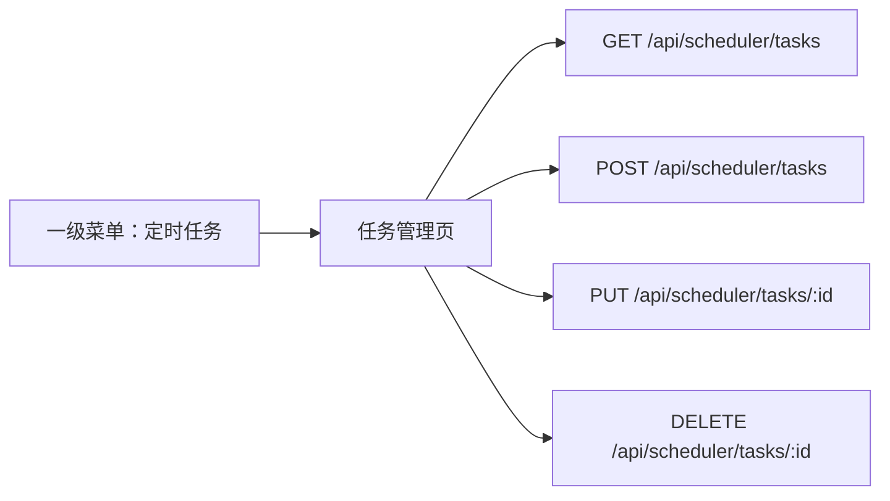

# 增加定时任务一级菜单计划

## Summary

新增一个一级菜单「定时任务」，用于管理平台注册的定时任务信息。页面范围按用户确认执行为「完整管理」：支持按任务名称和处理器筛选、分页展示常用字段、新增、编辑、删除和刷新。

接口来源为 `/Users/bytedance/src/ecom_backend/idl/ecom.proto` 中的 `ScheduledTaskItem` 与 `/api/scheduler/tasks` CRUD 定义。



## Current State Analysis

- 项目使用 `src/router/modules/*.ts` 自动注册静态菜单路由，一级菜单 rank 在 `src/router/enums.ts` 统一维护。
- 现有新增 Dashboard 菜单位于 `src/router/modules/dashboard.ts`，采用 `Layout` + 子路由页面模式，菜单文案通过 `locales/zh-CN.yaml` 和 `locales/en.yaml` 的 `menus.*` 配置。
- 现有真实后端接口模式可参考 `src/api/dashboard.ts`：使用 `http.request<T>()`，路径保持 `/api/...` 相对路径，由 Vite Proxy 处理后端域名。
- 管理类页面可参考 `src/views/system/role/index.vue`、`src/views/system/role/form.vue`、`src/views/system/role/utils/*`：使用 `PureTableBar`、`pure-table`、`addDialog`、Element Plus 表单校验与操作列。
- 后端 proto 已定义：
  - `ListScheduledTasksRequest`: `task_name`、`handler`、`limit`、`offset`
  - `ListScheduledTasksResponse`: `total`、`tasks`
  - `ScheduledTaskItem`: `id`、`task_name`、`cron_expr`、`handler`、`next_tick`、`last_execution_time`、`extra`、`created_time`、`updated_time`
  - 创建/更新仅包含 `task_name`、`cron_expr`、`handler`
  - 删除接口返回 `deleted`
- 当前项目未初始化 `.codegraph/`，本计划基于普通只读检索结果。

## Proposed Changes

### 1. API 类型与方法

文件：`src/api/scheduler.ts`

新增独立 scheduler API 文件，避免把定时任务接口塞进 `dashboard.ts` 或 mock 型 `system.ts`。

计划定义：

- `ScheduledTaskItem`
- `ListScheduledTasksParams`
- `ListScheduledTasksResult`
- `ScheduledTaskPayload`
- `DeleteScheduledTaskResult`
- `getScheduledTaskList(params)`
- `createScheduledTask(data)`
- `updateScheduledTask(id, data)`
- `deleteScheduledTask(id)`

请求约定：

- 列表：`GET /api/scheduler/tasks`，参数为 `{ task_name, handler, limit, offset }`
- 新增：`POST /api/scheduler/tasks`，body 为 `{ task_name, cron_expr, handler }`
- 编辑：`PUT /api/scheduler/tasks/:id`，body 为 `{ task_name, cron_expr, handler }`
- 删除：`DELETE /api/scheduler/tasks/:id`

### 2. 新增一级菜单路由

文件：`src/router/enums.ts`

- 新增 rank 常量：`scheduler = 29`
- 同步导出 `scheduler`

文件：`src/router/modules/scheduler.ts`

- 新增一级路由：
  - `path: "/scheduler"`
  - `name: "Scheduler"`
  - `component: Layout`
  - `redirect: "/scheduler/tasks"`
  - `meta.icon: "ri/time-line"`
  - `meta.title: $t("menus.pureScheduler")`
  - `meta.rank: scheduler`
- 新增子路由：
  - `path: "/scheduler/tasks"`
  - `name: "SchedulerTasks"`
  - `component: () => import("@/views/scheduler/tasks/index.vue")`
  - `meta.title: $t("menus.pureSchedulerTasks")`

### 3. 新增任务管理页面

文件：`src/views/scheduler/tasks/index.vue`

实现页面壳：

- 顶部搜索表单：
  - `任务名称` -> `task_name`
  - `处理器` -> `handler`
  - 搜索按钮、重置按钮
- `PureTableBar` 标题：`定时任务`
- 按钮区：`新增任务`
- 表格列展示常用字段：
  - `id`
  - `task_name`（任务名称）
  - `cron_expr`（Cron 表达式）
  - `handler`（处理器）
  - `next_tick`（下次执行时间）
  - `last_execution_time`（上次执行时间）
  - `created_time`（创建时间）
  - `updated_time`（更新时间）
  - 操作列：编辑、删除
- 不在主表格展示 `extra`，保持表格可读性。
- 使用 `pure-table` 分页，分页事件映射到后端 `limit/offset`。

文件：`src/views/scheduler/tasks/utils/hook.tsx`

封装页面状态和操作逻辑：

- `form`: `{ task_name: "", handler: "" }`
- `pagination`: `{ total: 0, pageSize: 10, currentPage: 1, background: true }`
- `onSearch()`: 将当前页转为 `offset = (currentPage - 1) * pageSize`，调用列表接口
- `resetForm(formRef)`: 重置筛选并回到第一页
- `handleSizeChange(pageSize)`: 更新 pageSize、回到第一页并重新查询
- `handleCurrentChange(currentPage)`: 更新页码并重新查询
- `openDialog(title, row?)`: 新增/编辑弹窗
- `handleDelete(row)`: 二次确认后调用删除接口，成功后刷新列表
- 错误处理：接口失败时使用 `message(..., { type: "error" })` 提示，并关闭 loading

文件：`src/views/scheduler/tasks/form.vue`

新增/编辑弹窗表单字段：

- `任务名称 task_name`
- `Cron 表达式 cron_expr`
- `处理器 handler`

文件：`src/views/scheduler/tasks/utils/rule.ts`

- 三个字段均必填。
- Cron 表达式只做必填校验，不做强正则校验，避免误拒绝后端支持的扩展表达式。

文件：`src/views/scheduler/tasks/utils/types.ts`

- 定义 `FormItemProps` 与 `FormProps`，字段对应 `ScheduledTaskPayload`。

### 4. 国际化文案

文件：`locales/zh-CN.yaml`

- `menus.pureScheduler: 定时任务`
- `menus.pureSchedulerTasks: 任务管理`

文件：`locales/en.yaml`

- `menus.pureScheduler: Scheduler`
- `menus.pureSchedulerTasks: Task Manage`

### 5. OpenSpec 同步

由于项目约定要求同步维护 OpenSpec，执行阶段同步新增变更文档：

目录：`openspec/changes/add-scheduler-task-management/`

- `proposal.md`: 说明新增定时任务一级菜单和管理页的背景、范围、非目标。
- `design.md`: 记录路由、API、页面状态、分页映射、错误处理和表单交互设计。
- `tasks.md`: 记录实现步骤和验证步骤。
- `specs/scheduler-task-management/spec.md`: 增加需求场景：
  - 顶级菜单可见
  - 列表按 `task_name` / `handler` 查询
  - 分页通过 `limit` / `offset` 请求
  - 新增/编辑/删除任务
  - 常用字段展示，`extra` 不作为主列

执行后如果功能完成，再按项目流程决定是否归档并同步到 `openspec/specs/`。

## Assumptions & Decisions

- 功能范围按用户选择实现「完整管理」，不是只读页面。
- 列表筛选只使用 proto 已声明的 `task_name` 和 `handler`，不增加前端虚假筛选条件。
- 表格只展示常用字段，不直接展示 `extra`。
- `extra` 本次不支持编辑，因为 create/update proto 没有 `extra` body 字段。
- Cron 表达式前端只做必填校验，合法性由后端最终判断。
- API 返回结构按 proto 直出，即 `ListScheduledTasksResponse` 在前端表现为 `{ total, tasks }`，不套用 mock 接口的 `{ code, data }` 结构。
- 失败提示使用现有 `@/utils/message`，成功后刷新当前列表。
- 删除当前页最后一条数据后，如果当前页没有数据且不是第一页，回退到上一页再次查询。

## Verification Steps

执行阶段完成代码后运行：

```bash
pnpm typecheck
pnpm lint
```

手动验证建议：

1. 打开应用，确认左侧出现一级菜单「定时任务」。
2. 进入「定时任务 / 任务管理」，确认会调用 `GET /api/scheduler/tasks?limit=10&offset=0`。
3. 输入任务名称或处理器筛选，确认 query 参数包含 `task_name` / `handler`。
4. 新增任务，确认调用 `POST /api/scheduler/tasks` 且列表刷新。
5. 编辑任务，确认调用 `PUT /api/scheduler/tasks/:id` 且列表刷新。
6. 删除任务，确认有二次确认，调用 `DELETE /api/scheduler/tasks/:id` 且列表刷新。
7. 检查表格只展示常用字段，`extra` 不作为主列。
