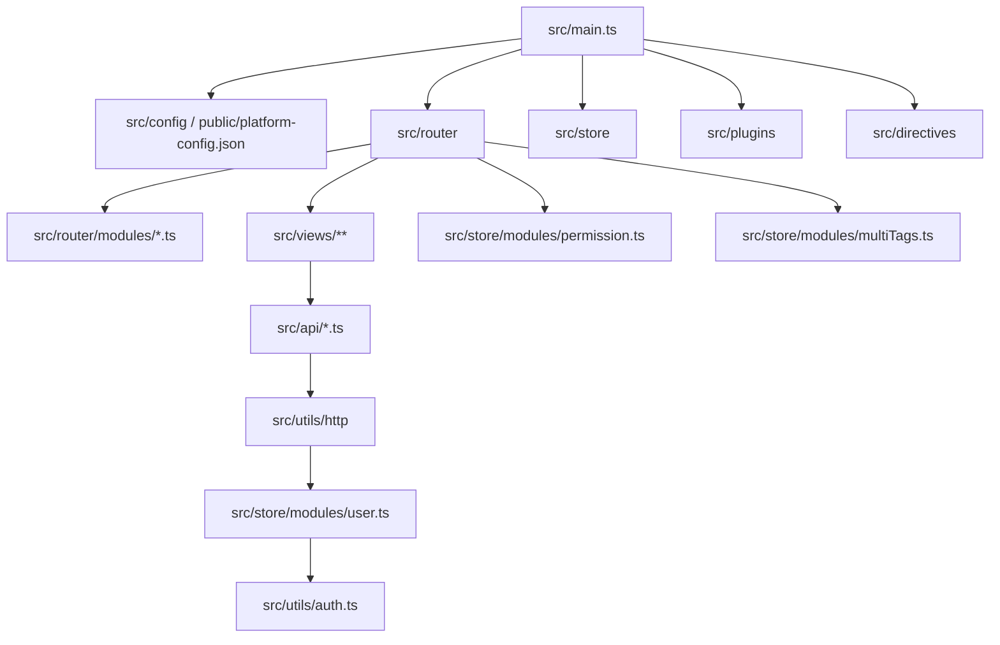

# AGENTS.md

面向大模型协作的项目说明。修改代码前先读本文件，再按现有结构做最小改动。

## 项目定位

`vue-pure-admin` 是基于 Vue 3、Vite、TypeScript、Element Plus、Pinia、Tailwind CSS 的中后台管理系统模板。代码采用 ESM 组织，主要能力包括登录鉴权、权限路由、动态菜单、多标签页、主题、国际化、表格、图表和常见后台页面示例。

## 运行与验证

使用 `pnpm`，不要改用 `npm` 或 `yarn`。

| 任务              | 命令                     |
| ----------------- | ------------------------ |
| 安装依赖          | `pnpm install`           |
| 本地开发          | `pnpm dev` 或 `make run` |
| 生产构建          | `pnpm build`             |
| 预览构建产物      | `pnpm preview`           |
| 类型检查          | `pnpm typecheck`         |
| 全量格式/静态检查 | `pnpm lint`              |
| ESLint 修复       | `pnpm lint:eslint`       |
| Prettier 格式化   | `pnpm lint:prettier`     |
| Stylelint 修复    | `pnpm lint:stylelint`    |

环境约束来自 `package.json`：Node `>=22.22.1`，pnpm `>=11`。CI 中会执行 `pnpm lint` 和 `pnpm typecheck`。

## 架构速览



启动链路：

1. `src/main.ts` 创建 Vue 应用。
2. `getPlatformConfig(app)` 读取平台配置。
3. 注册 Pinia、router、自定义指令、全局组件和插件。
4. `router.isReady()` 后挂载到 `#app`。

## 关键目录

| 路径                  | 作用                                                                 |
| --------------------- | -------------------------------------------------------------------- |
| `src/main.ts`         | 应用入口，注册路由、状态、插件、样式和全局组件。                     |
| `src/App.vue`         | 根组件。                                                             |
| `src/router/index.ts` | 路由实例、导航守卫、登录校验、动态路由初始化、标签页联动。           |
| `src/router/modules/` | 静态路由模块，除 `remaining.ts` 外会被 `import.meta.glob` 自动导入。 |
| `src/router/utils.ts` | 路由拍平、排序、动态路由和菜单处理工具。                             |
| `src/store/modules/`  | Pinia 模块：用户、权限、标签页、主题、设置、应用状态。               |
| `src/api/`            | API 方法定义，按业务文件拆分。                                       |
| `src/utils/http/`     | Axios 封装，请求/响应拦截、token 刷新、白名单。                      |
| `src/views/`          | 页面视图，通常与路由模块对应。                                       |
| `src/components/`     | 业务通用组件，组件目录多以 `Re*` 命名。                              |
| `src/layout/`         | 后台布局、导航、标签页、侧边栏等框架层。                             |
| `src/plugins/`        | Element Plus、i18n、ECharts、VXE Table 等插件注册。                  |
| `src/directives/`     | 自定义指令，如权限、复制、长按、波纹等。                             |
| `src/style/`          | 全局样式、主题、暗色、布局和 Tailwind 入口。                         |
| `build/`              | Vite 插件、构建工具、依赖预构建配置。                                |
| `mock/`               | 本地 mock 数据。                                                     |
| `locales/`            | 国际化文案，当前包含 `zh-CN.yaml` 和 `en.yaml`。                     |
| `types/`              | 全局类型声明。                                                       |
| `public/`             | 静态资源和 `platform-config.json`。                                  |

## 代码约定

- 使用 TypeScript、Vue SFC 和 Composition API 风格，优先跟随邻近文件写法。
- 路径别名：`@` 指向 `src`，`@build` 指向 `build`。
- 缩进 2 空格，LF 换行，UTF-8；见 `.editorconfig`。
- Prettier 约定：`arrowParens: "avoid"`，`trailingComma: "none"`。
- 提交信息遵循 Conventional Commits，允许类型见 `commitlint.config.js`。
- 新增依赖要谨慎；优先复用现有的 `@pureadmin/*`、Element Plus、VueUse、Pinia、Axios 工具。
- 不要把大段业务逻辑塞进路由守卫或组件模板；按现有模式放到 store、api、utils、hooks 中。

## 路由与菜单

- 新增菜单页面通常需要：
  1. 在 `src/views/<domain>/` 新增页面组件。
  2. 在 `src/router/modules/<domain>.ts` 新增或扩展路由。
  3. 配置 `meta.title`、`meta.icon`、`meta.rank`、`meta.roles`、`meta.keepAlive` 等字段。
  4. 如涉及国际化标题，更新 `locales/zh-CN.yaml` 和 `locales/en.yaml`。
- `src/router/index.ts` 会自动导入 `src/router/modules/**/*.ts`，但排除 `remaining.ts`。
- 三级及以上路由会被处理成二级路由用于页面渲染；菜单层级另由 `constantMenus` 保留。
- 不参与菜单的路由放在 `src/router/modules/remaining.ts`。
- 权限判断在路由守卫和权限 store 中，按钮权限通过全局 `Auth`、`Perms` 组件或相关指令处理。

## 状态与鉴权

- Pinia 入口是 `src/store/index.ts`，模块位于 `src/store/modules/`。
- 登录、登出、刷新 token 在 `src/store/modules/user.ts`。
- token 持久化和格式化在 `src/utils/auth.ts`。
- Axios 封装在 `src/utils/http/index.ts`，会对非白名单请求自动附加 `Authorization`。
- token 过期时由 HTTP 拦截器串行刷新，期间会暂存待重试请求；修改这块逻辑必须额外谨慎。

## API 与数据

- API 文件放在 `src/api/`，推荐按业务域拆分并导出具名函数。
- 统一使用 `http.request<T>()`、`http.get<T, P>()`、`http.post<T, P>()`，不要在页面组件中直接创建新的 Axios 实例。
- 请求返回类型应在 API 文件中声明，保持调用方可推断。
- mock 数据位于 `mock/`，用于本地开发和示例页面。

## UI 与样式

- 基础 UI 使用 Element Plus，复杂表格优先参考 `@pureadmin/table`、`vxe-table` 和现有表格页面。
- 全局样式入口在 `src/style/index.scss`，Tailwind 入口必须保持在 `src/main.ts` 中导入。
- 主题、暗色、侧边栏样式分别在 `src/style/theme.scss`、`dark.scss`、`sidebar.scss`。
- 新组件优先复用 `src/components/Re*` 中已有组件和布局模式。
- 修改可见 UI 后，至少运行相关 lint/typecheck；复杂交互建议本地启动并浏览器验证。

## 国际化

- i18n 插件在 `src/plugins/i18n.ts`。
- 文案文件在 `locales/zh-CN.yaml` 和 `locales/en.yaml`。
- 路由标题常使用 `$t("menus.xxx")`，展示标题使用 `transformI18n`。
- 新增菜单、页面标题、可复用按钮文案时同步中英文，不要只改一种语言。

## 常见改动入口

| 需求           | 优先查看                                                                   |
| -------------- | -------------------------------------------------------------------------- |
| 新增页面/菜单  | `src/router/modules/`、`src/views/`、`locales/`                            |
| 新增接口调用   | `src/api/`、`src/utils/http/`                                              |
| 修改登录/权限  | `src/store/modules/user.ts`、`permission.ts`、`src/router/index.ts`        |
| 修改标签页行为 | `src/store/modules/multiTags.ts`、`src/layout/`                            |
| 修改主题/布局  | `src/store/modules/settings.ts`、`epTheme.ts`、`src/layout/`、`src/style/` |
| 新增全局指令   | `src/directives/`、`src/main.ts`                                           |
| 新增全局插件   | `src/plugins/`、`src/main.ts`                                              |
| 构建配置       | `vite.config.ts`、`build/plugins.ts`、`build/utils.ts`                     |
| Docker 部署    | `Dockerfile`                                                               |

## 修改原则

- 遵循最小改动原则：只改与任务直接相关的文件。
- 不要重排无关 imports、批量格式化无关文件或替换既有架构。
- 先查找相邻实现，再按相同模式扩展。
- 不确定业务语义时，优先保留现有行为并补充局部兼容逻辑。
- 不要提交生成产物、缓存、`node_modules` 或 `dist`。
- 修改鉴权、路由初始化、HTTP 拦截器、构建插件时，要说明风险并加强验证。

## 测试状态

当前项目未发现专门的单元测试或 E2E 测试脚本。常规验证以以下命令为准：

```bash
pnpm lint
pnpm typecheck
pnpm build
```

窄范围样式或文案调整可至少执行相关 lint；涉及路由、权限、构建或基础组件时应执行 `pnpm typecheck` 和 `pnpm build`。

## 强制要求

1. 优先复用已有的代码和组件，避免重复造轮子。
