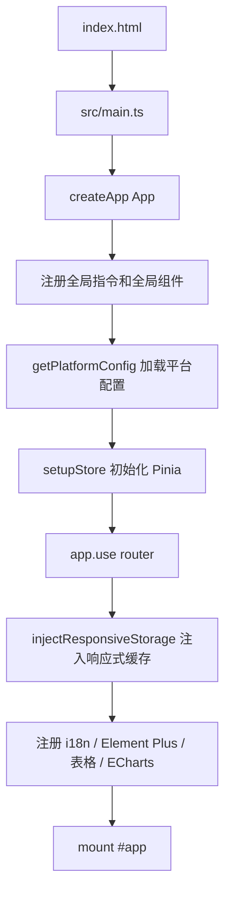
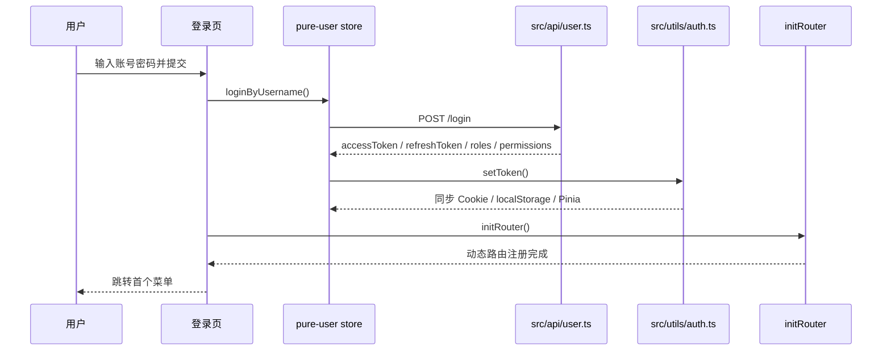
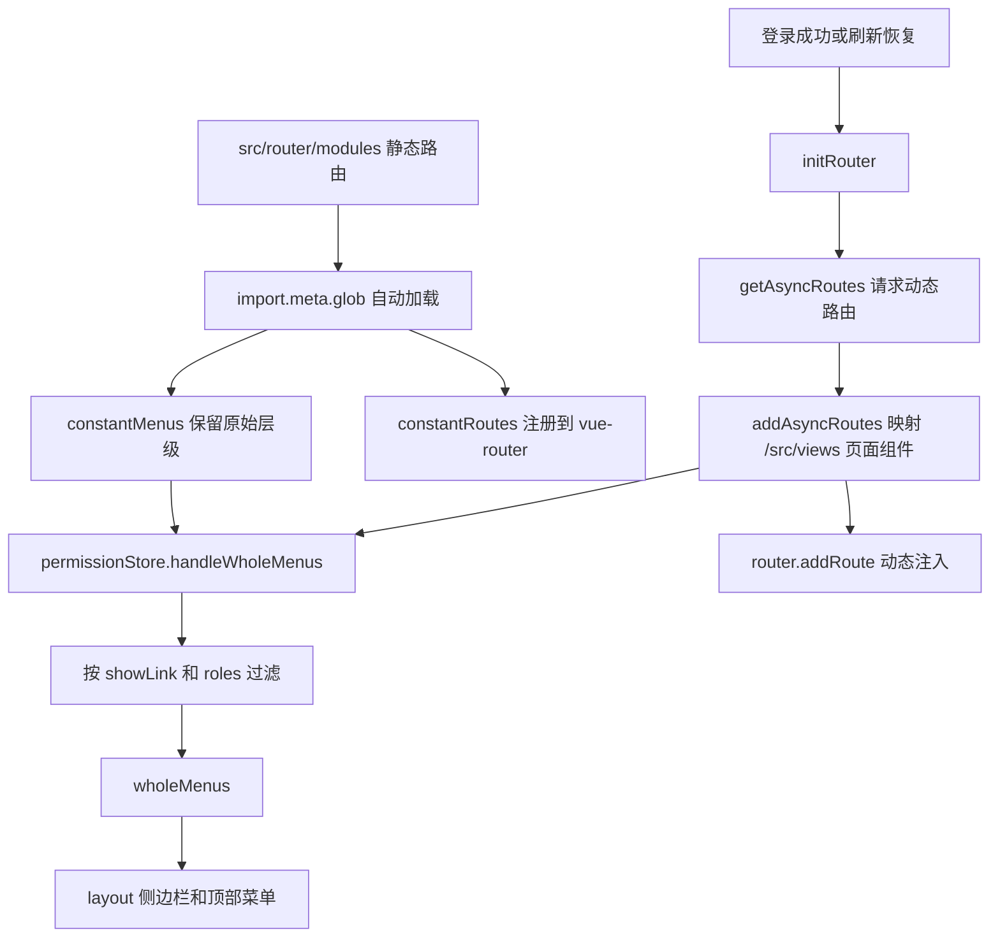
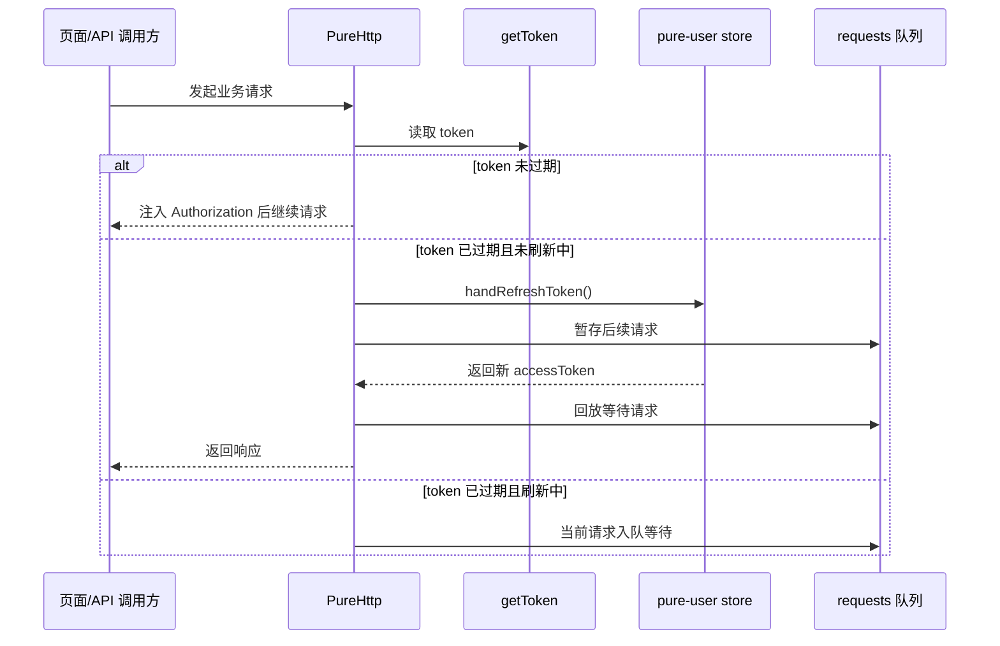
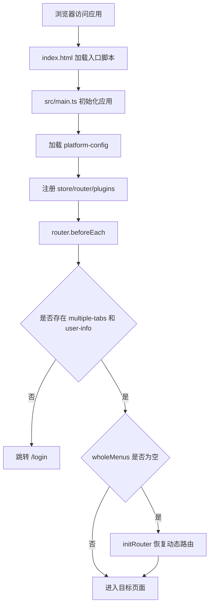
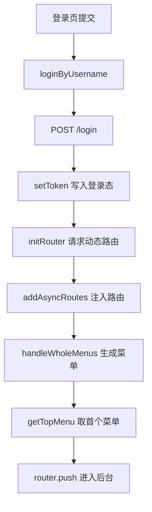
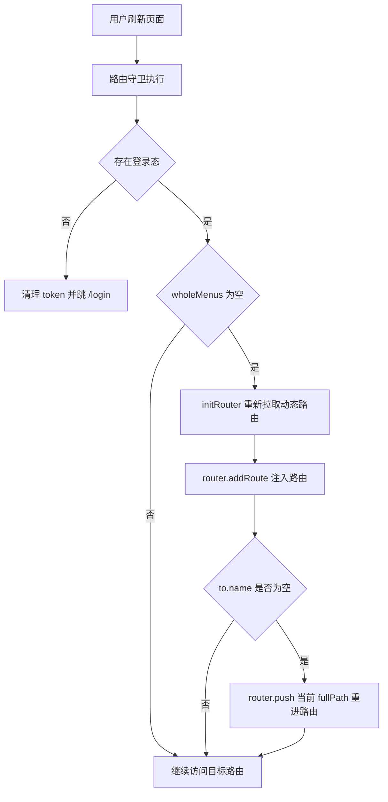
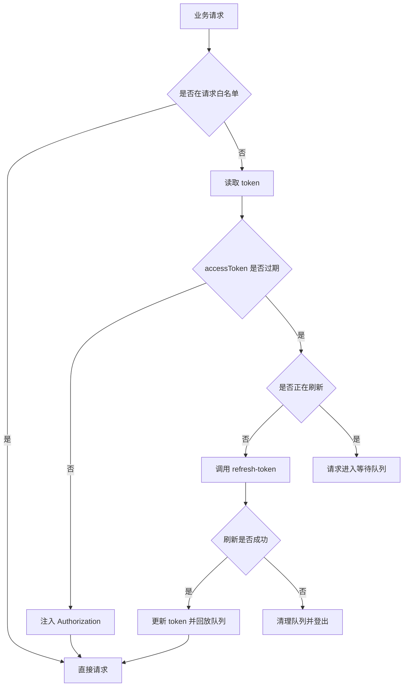

# 核心功能与关键链路

> [!info] 文档说明
> 本文基于当前仓库源码梳理 `vue-pure-admin` 的核心功能、模块边界和关键运行链路，主要服务于项目接手、二次开发和技术评审。

## 1. 项目定位

`vue-pure-admin` 是一个基于 `Vue 3 + TypeScript + Vite` 的中后台管理系统模板，核心能力围绕后台框架搭建、登录鉴权、动态路由、菜单权限、标签页缓存、主题布局、Mock/API 调试和常用页面组件展开。

| 维度      | 说明                                                                                 |
| --------- | ------------------------------------------------------------------------------------ |
| 前端框架  | `Vue 3`、`TypeScript`、`Vite`                                                        |
| UI 与组件 | `Element Plus`、`@pureadmin/table`、`@pureadmin/descriptions`、`plus-pro-components` |
| 状态管理  | `Pinia`                                                                              |
| 路由系统  | `vue-router`，支持静态路由自动扫描和后端动态路由注入                                 |
| 请求层    | `axios` 封装，内置 token 注入、过期刷新和并发请求队列                                |
| 样式体系  | `SCSS`、`Tailwind CSS`、Element Plus 主题样式                                        |
| 国际化    | `vue-i18n` + `locales/*.yaml`                                                        |
| Mock      | `vite-plugin-fake-server` + `mock/`                                                  |
| 运行要求  | `node >= 22.22.1`，`pnpm >= 11`                                                      |

## 2. 核心目录地图

```text
vue-pure-admin
├── build/                  # Vite 插件、压缩、CDN、构建信息等工程化配置
├── doc/                    # 项目文档
├── locales/                # 国际化资源
├── mock/                   # 本地 Mock 接口
├── public/                 # 静态资源与运行时平台配置
├── src/
│   ├── api/                # API 薄封装
│   ├── components/         # 通用组件与全局组件
│   ├── config/             # platform-config 加载与读取
│   ├── directives/         # 自定义指令
│   ├── layout/             # 后台主布局、导航、侧边栏、标签页、设置面板
│   ├── plugins/            # Element Plus、i18n、ECharts、VxeTable 等插件注册
│   ├── router/             # 路由注册、动态路由、权限过滤
│   ├── store/              # Pinia store
│   ├── style/              # 全局样式、主题、暗色、过渡
│   ├── utils/              # 通用工具、HTTP、认证、缓存、进度条
│   └── views/              # 页面视图
└── types/                  # 全局类型声明
```

## 3. 核心功能

### 3.1 应用启动与插件装配

入口链路从 `index.html` 进入 `src/main.ts`，先创建 Vue 应用，再注册全局指令、图标组件、按钮权限组件和 `vue-tippy`。随后通过 `getPlatformConfig(app)` 加载 `public/platform-config.json`，再装配 `Pinia`、`router`、响应式缓存、动效、国际化、Element Plus、表格、描述组件和 ECharts，最后挂载到 `#app`。

关键文件：

| 文件                          | 职责                                           |
| ----------------------------- | ---------------------------------------------- |
| `src/main.ts`                 | 应用创建、插件注册、平台配置加载、挂载入口     |
| `src/App.vue`                 | 根组件，承载 `router-view` 和全局弹窗/抽屉容器 |
| `src/config/index.ts`         | 运行时平台配置读取                             |
| `public/platform-config.json` | 平台标题、布局、缓存动态路由等运行时配置       |



### 3.2 登录鉴权

登录页在 `src/views/login/index.vue`。用户提交表单后调用 `useUserStoreHook().loginByUsername()`，登录成功后写入 token 和用户信息，再调用 `initRouter()` 获取动态路由，最后跳转到首个可访问菜单。

用户态由 `src/store/modules/user.ts` 和 `src/utils/auth.ts` 共同维护：

| 存储项             | 位置         | 作用                                                 |
| ------------------ | ------------ | ---------------------------------------------------- |
| `authorized-token` | Cookie       | 保存 `accessToken`、`expires`、`refreshToken`        |
| `multiple-tabs`    | Cookie       | 标记当前浏览器会话是否已登录，用于多标签页免重复登录 |
| `user-info`        | localStorage | 保存用户资料、角色、按钮权限、刷新信息               |
| `pure-user`        | Pinia        | 维护当前运行时用户态、登录页状态和 token 刷新动作    |



### 3.3 路由、菜单与页面权限

路由系统分为静态路由和动态路由：

- 静态路由：`src/router/modules/**/*.ts` 自动扫描，排除 `remaining.ts`。
- 保留路由：`src/router/modules/remaining.ts`，包含登录页、错误页、重定向等不参与常规菜单的路由。
- 动态路由：登录成功或刷新恢复时由 `src/api/routes.ts` 请求 `/get-async-routes`，再由 `src/router/utils.ts` 映射真实页面组件并注入路由表。

菜单最终由 `src/store/modules/permission.ts` 的 `handleWholeMenus()` 生成：

```text
静态菜单 constantMenus + 后端动态路由
  -> ascending 排序
  -> filterTree 过滤 showLink=false
  -> filterNoPermissionTree 按 meta.roles 过滤
  -> wholeMenus
  -> layout 侧边栏渲染
```



页面权限基于路由 `meta.roles`：

- 路由守卫中检查目标路由 `to.meta.roles` 与当前用户 `roles` 是否匹配。
- 菜单生成时也会按角色过滤不可访问菜单。
- 无权限访问跳转 `/error/403`。

### 3.4 按钮级权限

项目存在两套按钮权限能力：

| 能力         | 判断来源                     | 使用方式               |
| ------------ | ---------------------------- | ---------------------- |
| `hasAuth()`  | 当前路由 `meta.auths`        | `<Auth />`、`v-auth`   |
| `hasPerms()` | 登录接口返回的 `permissions` | `<Perms />`、`v-perms` |

关键文件：

| 文件                     | 职责                                   |
| ------------------------ | -------------------------------------- |
| `src/router/utils.ts`    | `hasAuth()` 判断当前路由声明的按钮权限 |
| `src/utils/auth.ts`      | `hasPerms()` 判断登录用户权限码        |
| `src/components/ReAuth`  | 基于 `meta.auths` 的权限组件           |
| `src/components/RePerms` | 基于 `permissions` 的权限组件          |
| `src/directives/auth`    | `v-auth` 指令                          |
| `src/directives/perms`   | `v-perms` 指令                         |

### 3.5 HTTP 请求与无感刷新 token

请求层封装在 `src/utils/http/index.ts`。API 层通常只做薄封装，例如 `src/api/user.ts`、`src/api/routes.ts`、`src/api/system.ts`。

请求拦截逻辑：

1. `/login`、`/refresh-token` 在白名单内，不注入 token。
2. 非白名单请求读取 `getToken()`。
3. token 未过期时注入 `Authorization: Bearer ${accessToken}`。
4. token 过期时用 `refreshToken` 调用刷新接口。
5. 刷新期间通过 `isRefreshing` 防止并发重复刷新，其他请求进入 `requests` 队列。
6. 刷新成功后回放队列请求；刷新失败则登出并提示登录过期。



### 3.6 Mock 与本地 API 调试

Mock 能力由 `vite-plugin-fake-server` 提供，配置在 `build/plugins.ts`，接口文件位于 `mock/`。

| Mock 文件              | 接口能力                                 |
| ---------------------- | ---------------------------------------- |
| `mock/login.ts`        | 登录接口，返回用户角色、按钮权限和 token |
| `mock/refreshToken.ts` | 刷新 token                               |
| `mock/asyncRoutes.ts`  | 动态路由数据                             |
| `mock/mine.ts`         | 当前用户信息                             |
| `mock/system.ts`       | 系统管理相关数据                         |
| `mock/list.ts`         | 列表页演示数据                           |

当前仓库的 axios 没有显式配置 `baseURL`，`vite.config.ts` 中 `proxy` 为空；因此 `/login`、`/get-async-routes` 等请求默认走同源路径，由 Mock 插件或真实后端接管。

### 3.7 布局、标签页与缓存

后台主框架集中在 `src/layout/`：

| 模块                   | 职责                       |
| ---------------------- | -------------------------- |
| `src/layout/index.vue` | 后台主布局入口             |
| `lay-sidebar`          | 侧边栏、横向菜单、混合菜单 |
| `lay-navbar`           | 顶部导航                   |
| `lay-tag`              | 多标签页                   |
| `lay-setting`          | 布局与主题设置             |
| `lay-content`          | 内容区和路由视图承载       |

标签页由 `src/store/modules/multiTags.ts` 维护，页面缓存由 `src/store/modules/permission.ts` 的 `cachePageList` 与路由 `meta.keepAlive` 联动。路由守卫进入页面时会调用 `handleAliveRoute()` 维护缓存状态。

### 3.8 主题、国际化与运行时配置

| 能力           | 关键文件                                                        | 说明                                         |
| -------------- | --------------------------------------------------------------- | -------------------------------------------- |
| 主题与暗色模式 | `src/layout/hooks/useDataThemeChange.ts`、`src/style/dark.scss` | 切换主题色、暗色样式和 Element Plus 样式变量 |
| 布局配置       | `public/platform-config.json`、`src/config/index.ts`            | 控制标题、路由缓存、布局模式等运行时配置     |
| 国际化         | `src/plugins/i18n.ts`、`locales/zh-CN.yaml`、`locales/en.yaml`  | 支持页面标题、菜单、登录页等文案翻译         |
| 响应式缓存     | `src/utils/responsive.ts`                                       | 注入布局、主题、侧边栏等响应式存储           |

### 3.9 页面与功能示例

`src/views/` 覆盖了后台模板常见页面和能力示例：

| 目录                                    | 功能                                                   |
| --------------------------------------- | ------------------------------------------------------ |
| `login/`                                | 登录页、多登录方式 UI、主题和国际化切换                |
| `welcome/`                              | 首页看板                                               |
| `system/`                               | 系统管理相关页面                                       |
| `table/`                                | 表格、虚拟表格、可编辑表格                             |
| `components/`                           | 基础组件演示                                           |
| `able/`                                 | 二维码、条形码、PDF、Excel、地图、MQTT、视频等能力示例 |
| `error/`                                | 403、404、500 错误页                                   |
| `tabs/`                                 | 标签页参数传递和缓存示例                               |
| `flow-chart/`、`ganttastic/`、`chatai/` | 流程图、甘特图、聊天 AI 等高级示例                     |

## 4. 关键链路总览

### 4.1 首次打开应用



### 4.2 登录后进入后台



### 4.3 刷新页面恢复动态路由



### 4.4 请求 token 过期刷新



## 5. 二次开发常用入口

| 目标              | 建议修改位置                                                                                    |
| ----------------- | ----------------------------------------------------------------------------------------------- |
| 新增静态菜单页面  | 新增 `src/router/modules/*.ts` 和对应 `src/views/**` 页面                                       |
| 接入后端动态菜单  | 替换 `src/api/routes.ts` 对应接口，保证返回结构能被 `addAsyncRoutes()` 识别                     |
| 替换登录接口      | 修改 `src/api/user.ts`、`src/store/modules/user.ts`、`src/utils/auth.ts` 中 token 字段适配逻辑  |
| 接入真实后端      | 配置 axios `baseURL` 或 Vite `server.proxy`，按需关闭/调整 Mock                                 |
| 新增按钮权限      | 在路由 `meta.auths` 或登录返回 `permissions` 中声明，再使用 `<Auth />` / `<Perms />` 或对应指令 |
| 调整布局主题      | 修改 `public/platform-config.json`、`src/layout/hooks`、`src/style/theme.scss`                  |
| 新增国际化文案    | 更新 `locales/zh-CN.yaml` 和 `locales/en.yaml`                                                  |
| 新增全局组件/插件 | 在 `src/main.ts` 或 `src/plugins/` 中注册                                                       |

## 6. 当前风险与注意点

1. **Mock 默认覆盖面较大**：`vite-plugin-fake-server` 当前配置了 `enableProd: true`，生产构建也会启用 Mock，接入真实后端前需要明确是否保留。
2. **动态路由依赖组件路径匹配**：后端返回的 `component` 字符串必须能匹配 `import.meta.glob("/src/views/**/*.{vue,tsx}")` 中的真实文件。
3. **登录态判断依赖 Cookie + localStorage**：路由守卫以 `multiple-tabs` 和 `user-info` 共同判断是否已登录，改造 SSO 或 token 存储时需要同步调整。
4. **页面权限和按钮权限来源不同**：页面/菜单权限基于 `roles`，按钮权限可基于 `meta.auths` 或 `permissions`，二次开发时需要统一使用规范，避免同一页面混用造成理解成本。
5. **当前仓库未发现测试用例**：未看到 `tests/`、`*.spec.*` 或 `*.test.*`，后续改造登录、路由、权限、请求层时建议补充单测或 E2E 验证。

## 7. 参考文件索引

| 主题          | 文件                                                 |
| ------------- | ---------------------------------------------------- |
| 应用入口      | `src/main.ts`、`src/App.vue`                         |
| 运行时配置    | `src/config/index.ts`、`public/platform-config.json` |
| 路由入口      | `src/router/index.ts`                                |
| 路由工具      | `src/router/utils.ts`                                |
| 静态路由      | `src/router/modules/*.ts`                            |
| 保留路由      | `src/router/modules/remaining.ts`                    |
| 用户 Store    | `src/store/modules/user.ts`                          |
| 权限 Store    | `src/store/modules/permission.ts`                    |
| 标签页 Store  | `src/store/modules/multiTags.ts`                     |
| 认证工具      | `src/utils/auth.ts`                                  |
| HTTP 封装     | `src/utils/http/index.ts`                            |
| 登录 API      | `src/api/user.ts`                                    |
| 动态路由 API  | `src/api/routes.ts`                                  |
| Mock 登录     | `mock/login.ts`                                      |
| Mock 动态路由 | `mock/asyncRoutes.ts`                                |
| 主布局        | `src/layout/index.vue`、`src/layout/components/**`   |
| 登录页        | `src/views/login/index.vue`                          |
