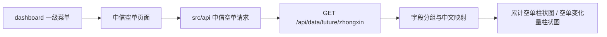

## Context

`vue-pure-admin` 已有路由模块、国际化菜单、API 封装和 ECharts 接入模式。新增能力应复用现有 `src/router/modules/*`、`src/api/*`、`useECharts`、Element Plus 卡片布局和 i18n 文案，不引入新的图表或请求依赖。

后端接口契约来自 `/Users/bytedance/src/ecom_backend/idl/ecom.proto`：

- GET `/api/data/future/zhongxin`
- 查询参数：`start_date`、`end_date`，默认展示最新值时不传任何参数
- 响应：`items: ZhongxinFutureShortPositionItem[]`
- 字段包含日期、累计空单字段、空单变化量字段

## Goals / Non-Goals

**Goals:**

- 新增 `dashboard` 一级菜单，并在其下提供中信空单数据板块。
- 默认进入页面时不传查询参数，获取当前最新数据。
- 将最新记录分为“累计空单”和“空单变化量”两组。
- 按用户指定映射展示中文名称，并用柱状图展示每个数值。
- 保持实现与现有 Vue 3、TypeScript、Element Plus、ECharts 和 i18n 模式一致。

**Non-Goals:**

- 不新增或修改后端接口。
- 不实现日期筛选、历史趋势、多日对比或导出能力。
- 不新增权限模型；沿用现有路由菜单展示机制。

## Decisions

1. **新增独立 dashboard 路由模块**

   在 `src/router/modules/dashboard.ts` 新增一级菜单，使用现有 `Layout` 包裹子页面。这样与现有静态菜单自动导入机制一致，后续新增 dashboard 子板块时也有明确扩展点。

2. **新增业务 API 文件并声明响应类型**

   在 `src/api/` 下新增按业务命名的 API 文件，声明 `ZhongxinFutureShortPositionItem`、请求参数和响应类型，通过现有 `http.request<T>()` 发起 GET 请求。默认加载时不传 `params`，避免把空对象或空字符串误传为查询参数。

3. **页面层负责数据选择与展示转换**

   页面拿到 `items` 后选取最新记录。若接口默认返回多条，按 `date` 降序取最新；若只返回一条，直接使用该条。字段映射以常量表维护，避免模板中散落硬编码。

4. **复用现有 ECharts 接入**

   柱状图通过 `@pureadmin/utils` 的 `useECharts` 和项目已有 ECharts 注册能力实现。页面可以抽出一个轻量柱状图组件，也可以在 dashboard 页面内局部封装；若仅本页使用，优先局部封装以控制改动范围。

5. **展示拆分为两个卡片**

   使用两个 Element Plus card 区域分别承载：
   - 累计空单：`IH_net_short`、`IF_net_short`、`IC_net_short`、`IM_net_short`、`total_net_short`
   - 空单变化量：`IH_net_short_diff`、`IF_net_short_diff`、`IC_net_short_diff`、`IM_net_short_diff`、`total_net_short_diff`

## Risks / Trade-offs

- [接口默认返回多条数据] → 前端按 `date` 降序兜底选择最新记录，并保留接口默认只返回最新值的正常路径。
- [字段大小可能有正负值] → 柱状图需支持负值轴线，不假设所有空单变化量为正。
- [接口失败或无数据] → 页面展示 Element Plus 空状态或错误提示，不渲染误导性 0 值。
- [菜单命名与现有首页概念重叠] → `dashboard` 作为新的一级数据看板入口，不复用当前 `/welcome` 首页，避免改变现有首页行为。

## Migration Plan

1. 新增 API 类型和请求方法。
2. 新增 dashboard 路由、页面目录和 i18n 文案。
3. 实现默认加载、数据转换、两个柱状图展示和空/错误状态。
4. 运行 `pnpm typecheck`，必要时运行 `pnpm lint`。

回滚时删除新增 API 文件、dashboard 路由、页面目录和对应 i18n 文案即可，不涉及数据迁移。

## Open Questions

- 是否后续需要增加日期筛选能力？本次按当前需求不纳入范围。
